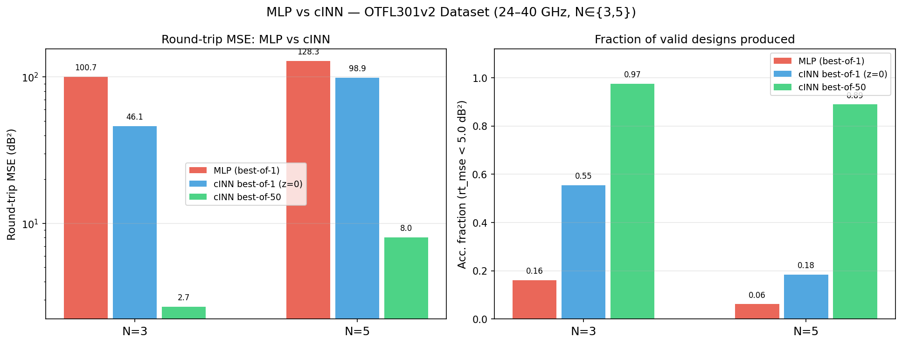
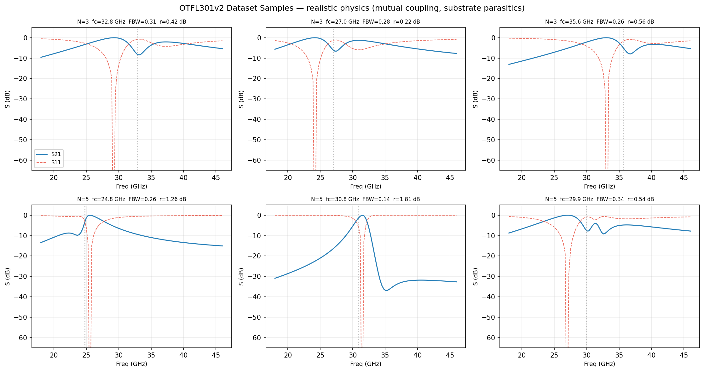
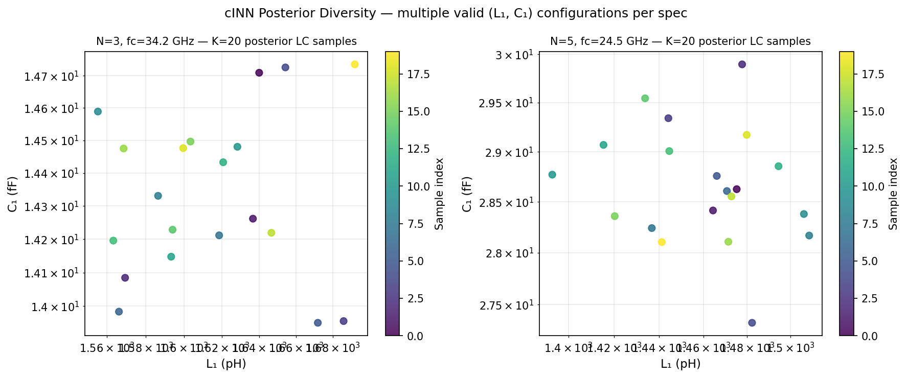
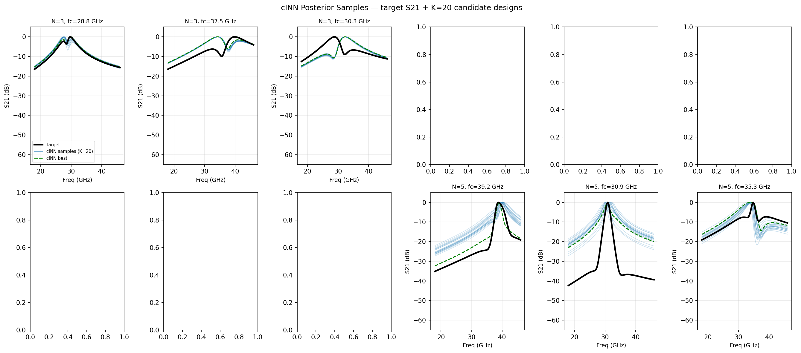
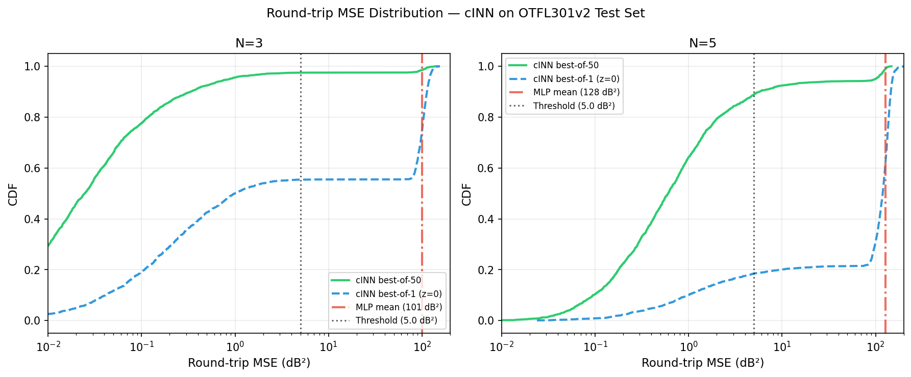

# RF Filter Inverse Design with Conditional Invertible Neural Networks

**Given a desired S-parameter response, generate multiple valid LC filter configurations that achieve it.**

This project builds and evaluates a machine learning pipeline for RF bandpass filter inverse design, targeting 24–40 GHz SOI CMOS on-chip filters. The core result: a conditional Invertible Neural Network (cINN) achieves **97.5% design success rate (N=3) and 89.0% (N=5)** with best-of-50 posterior sampling, versus **16.2% and 6.2%** for an MLP baseline — demonstrating that modeling the full posterior p(LC | S-params) is fundamentally necessary for this problem.



---

## Table of Contents

1. [Problem Statement & Motivation](#1-problem-statement--motivation)
2. [RF Background](#2-rf-background)
3. [Dataset: OTFL301v2](#3-dataset-otfl301v2)
4. [Model Architectures](#4-model-architectures)
5. [Training Details](#5-training-details)
6. [Evaluation Methodology](#6-evaluation-methodology)
7. [Results](#7-results)
8. [Discussion: What This Proves and What It Doesn't](#8-discussion-what-this-proves-and-what-it-doesnt)
9. [Future Work](#9-future-work)
10. [Transfer to Real EMX Data](#10-transfer-to-real-emx-data)
11. [Project Structure](#11-project-structure)
12. [Setup & How to Run](#12-setup--how-to-run)
13. [References](#13-references)

---

## 1. Problem Statement & Motivation

Designing on-chip RF bandpass filters for mm-wave SoC applications requires mapping desired transmission and reflection specifications to physical component values — inductances (L) and capacitances (C) for each resonator. Classical Chebyshev synthesis (Pozar Ch. 8) solves this exactly for ideal components.

On-chip CMOS at mm-wave frequencies, components are not ideal. Spiral inductors have resistive loss (Q_L ≈ 15–30). Metal-insulator-metal capacitors have frequency-dependent loss (Q_C ≈ 100–300, decreasing with frequency). Adjacent inductors couple magnetically. The silicon substrate introduces parasitic shunt capacitances. Fabrication variation shifts every component by ±3–4%. The classical synthesis equations no longer close.

The resulting **inverse design problem** — given desired S-parameters, find the LC values — has two compounding difficulties:

**Difficulty 1: sensitivity.** ABCD synthesis is highly nonlinear near resonance. A 1% error in L or C shifts each resonator's center frequency by ~0.5%, which at 30 GHz is ~150–300 MHz. In the steep transition regions of a 5th-order filter, this causes S-parameter deviations of tens of dB. A model that predicts LC accurately in a least-squares sense can still produce a filter that completely fails the spec.

**Difficulty 2: non-uniqueness.** Multiple distinct LC configurations produce nearly identical S-parameter responses — the forward map is many-to-one when Q values, mutual coupling, and substrate parasitics are treated as partially unknown. The inverse problem has a multi-modal posterior distribution p(LC | S-params).

**Why a point-estimate model fails on non-unique problems.** An MLP minimizes `E[||ŷ − y||²]`. For a multi-modal posterior, the minimizer is the conditional mean — the weighted average across all valid modes. This average lies between the modes and corresponds to none of them. The MLP can achieve R² = 0.995 on log-LC predictions and still produce filters with 100 dB² synthesis error, because the averaged LC values don't synthesize a working filter for any mode.

**The solution: model the posterior.** A cINN learns the full distribution p(LC | S-params, parasitics) via a bijective transformation to a latent Gaussian space. At inference time, sampling K candidates from this posterior and evaluating each gives the designer multiple distinct valid configurations to choose from. Even if most samples are mediocre, a small K is sufficient to reliably find one good design.

---

## 2. RF Background

### S-parameters

S-parameters characterize two-port networks at 50 Ω termination:
- **S21**: transmission — `V₂⁻/V₁⁺`. Target: near 0 dB in passband (low insertion loss), below −30 to −40 dB in stopband.
- **S11**: reflection — `V₁⁻/V₁⁺`. Target: below −20 dB in passband (low return loss).

All S-params here in dB: 20·log₁₀(voltage ratio).

### LC Resonators and Chebyshev Synthesis

Each resonator is an LC tank (series or shunt in the ladder). The key property: `L_k · C_k = 1/ω₀²` — every pair resonates at the center frequency fc. Chebyshev synthesis computes normalized g-values (dimensionless prototype elements) from (N, ripple_dB), then scales to physical values:

```
Series branch k:  L_k = g_k · Z₀ / (ω₀ · fbw),   C_k = fbw / (g_k · Z₀ · ω₀)
Shunt  branch k:  L_k = fbw · Z₀ / (g_k · ω₀),   C_k = g_k / (fbw · Z₀ · ω₀)
```

where ω₀ = 2π·fc, Z₀ = 50 Ω, and the ladder starts with a series branch.

### ABCD Cascade

A ladder filter is modeled as a chain of 2×2 ABCD matrices — one per series branch, one per shunt branch. The chain product gives the two-port ABCD of the full filter:

```
M_total = M₁ · M₂ · ... · M₂ₙ
S21 = 2 / (A + B/Z₀ + C·Z₀ + D)
```

Loss is included by adding series resistance to each inductor `R_s = ω₀·L/Q_L · √(f/f₀)` and parallel resistance to each capacitor `R_esr = 1/(ω₀·C·Q_C) · (f/f₀)^α`.

### Non-Uniqueness — Why the Inverse Problem is Hard

Two distinct sources of multi-modality:

1. **Q as unobserved confounder.** S-params are generated from (LC, Q). A lower-Q filter with slightly different LC values can produce a nearly identical passband shape. The inverse map from S-params to LC is ambiguous when Q is not observed.

2. **Parasitic sensitivity.** Mutual inductance coupling k_m shifts effective inductance. Substrate capacitance shifts resonant frequency. Multiple (LC, k_m, C_sub) combinations satisfy the same spec. Conditioning on the parasitics that generated a specific S-param curve resolves most of this ambiguity — but those parasitics are not freely available in a real EMX flow (see [Section 8](#8-discussion-what-this-proves-and-what-it-doesnt)).

---

## 3. Dataset: OTFL301v2

**50,000 samples — N ∈ {3, 5} resonators — 24–40 GHz SOI — 4 physics improvements**

### Generation Pipeline

For each sample:
1. **Sample specs:** fc_GHz ~ U[24, 40], fbw ~ U[0.08, 0.50], ripple_dB ~ U[0.05, 2.0], N ∈ {3, 5}
2. **Compute g-values** via Chebyshev prototype equations → nominal L_k, C_k
3. **Apply process spread:** L_actual ~ LogNormal(L_k, σ=4%), C_actual ~ LogNormal(C_k, σ=3%) (independent per element)
4. **Sample parasitics:** Q_L ~ U[15, 30], Q_C ~ U[100, 300], k_m ~ U[±0.02, ±0.15], C_sub_frac ~ U[0.01, 0.06], α_C ~ U[0.1, 0.5]
5. **Run enhanced lossy ABCD cascade** → S21, S11
6. **Quality filter:** discard if peak IL > −10 dB or RL > −5 dB (relaxed for SOI parasitics)

Source: [data/generate_otfl301v2.py](data/generate_otfl301v2.py)

### The 4 Physics Improvements

Beyond basic lossy-LC synthesis, four real on-chip effects are modeled:

**1. Mutual inductance (k_m)**

Adjacent spiral inductors on-chip couple magnetically. The effective inductance shifts:

```
L_eff[k] = L[k] + k_m[k-1] · min(L[k-1], L[k]) + k_m[k] · min(L[k], L[k+1])
```

k_m ∈ [0.02, 0.12], signed. Modeled as a T-equivalent; valid for |k_m| < 0.2.
*Physics confidence: ~80% (T-equivalent is approximate at strong coupling).*

**2. Substrate parasitic capacitance (C_sub)**

The silicon substrate under each capacitor acts as a shunt path to ground. Modeled as an additional shunt admittance `jωC_sub[k]` inserted before each resonator:

```
C_sub[k] = C_sub_frac[k] · C_actual[k],   C_sub_frac ~ U[0.01, 0.06]
```

*Physics confidence: ~70% (order-of-magnitude for SOI oxide cap; real value depends on layout geometry).*

**3. Frequency-dependent capacitor Q (α_C)**

Dielectric loss in MIM capacitors follows a power law with frequency:

```
R_esr(f) = R_esr(fc) · (f/fc)^α_C,   α_C ~ U[0.1, 0.5]
```

*Physics confidence: ~85% (power law is well-established for dielectric loss).*

**4. Process spread**

Log-normal variation on all component values per fabrication run:
```
L_actual ~ LogNormal(L_nominal, σ_L=4%)
C_actual ~ LogNormal(C_nominal, σ_C=3%)
```

*Physics confidence: ~75% (typical SOI fab variation; exact σ is foundry-specific).*

### Dataset Layout

**Input X_full (207-dim):**
```
[0]       fc_GHz       (fc_nominal — the design target, not the grid-snapped peak)
[1]       fbw
[2]       ripple_dB
[3]       N3_flag      (1 if N=3)
[4]       N5_flag      (1 if N=5)
[5:106]   S21_dB       (101 frequency points, 18–46 GHz)
[106:207] S11_dB       (101 frequency points)
```

**Target y_log (10-dim, NaN-padded for N=3):**
```
[0,2,4,6,8]  log10(L₁, L₂, L₃, L₄, L₅)  [Henries]
[1,3,5,7,9]  log10(C₁, C₂, C₃, C₄, C₅)  [Farads]
```

**Metadata (not in X — used only for honest evaluation):**
```
Q_L         (50000, 5)   per-inductor quality factor
Q_C         (50000, 5)   per-capacitor quality factor
k_m         (50000, 4)   mutual coupling coefficients
C_sub_frac  (50000, 5)   substrate cap fraction
alpha_C     (50000, 5)   freq-dep Q_C exponent
```

All NaN-padded to width 5; N=3 samples have NaN in positions 3–4.

### Note on fc_nominal vs fc_actual

All datasets store `fc_nominal` — the design parameter fed into Chebyshev synthesis — not `fc_actual` (the grid-snapped S21 peak). The ±0.25 GHz discretization of the frequency grid causes 80–250 dB² round-trip MSE even for perfect predictions if fc_actual is used. This distinction is critical for all downstream evaluation.

### Documented Limitations

- **ABCD is not EM simulation.** The cascade model captures nearest-neighbor mutual coupling and substrate parasitics but ignores via coupling, port discontinuities, bond-wire effects, cross-coupling between non-adjacent resonators, and metal layer parasitics beyond Q_L/Q_C. Real EMX simulation would capture all of these.
- **S11 is approximate.** S11 is derived from the lossless identity `S11 = √(1 − |S21|²)` rather than the full ABCD S11. At the passband peak this produces unphysical −120 dB values (floored at −60 dB in training). A real EM simulation would compute S11 independently.
- **N=4 excluded.** Only N ∈ {3, 5}. N=4 was omitted for demonstration clarity; adding it requires no architectural changes.
- **No tuning states.** Switched-capacitor tuning is a documented extension (condition on bit pattern, or train one model per state) but not included — it adds discrete conditioning complexity without strengthening the cINN-vs-MLP comparison.
- **Confidence on physics effects varies.** Each effect is documented with an estimated physics confidence (see above). The model is a proxy dataset for pipeline validation, not a first-principles EMX replacement.

**Representative dataset samples:**



---

## 4. Model Architectures

### 4a. MLP Baseline

**Architecture:** `InverseMLP` ([models/mlp.py](models/mlp.py))

```
Input: 207-dim X_full
  ↓
Shared trunk: 207 → 512 → 256 → 128
              (Linear, BatchNorm, ReLU, Dropout 0.2)
  ↓
N-specific heads:
  head_3: 128 → 6   (N=3: log₁₀[L₁,C₁,L₂,C₂,L₃,C₃])
  head_5: 128 → 10  (N=5: log₁₀[L₁,C₁,...,L₅,C₅])
```

~280k parameters. Trained on MSE loss against `y_log` with per-N StandardScaler normalization.

**Why the MLP fails — the formal argument.**

The MLP minimizes:
```
argmin_θ  E[||f_θ(x) − y||²]  =  E[y | x]
```
For a multi-modal posterior p(y|x), the minimizer is the conditional mean — the weighted average across all valid modes. Each mode corresponds to a different valid LC configuration for the given S-param spec. The conditional mean lies between these modes and corresponds to none of them physically.

The empirical signature: MLP achieves R² = 0.9952 on log₁₀(LC) — it is correctly computing the conditional mean — but rt_mse = 100 dB² because the averaged LC values synthesize a filter that doesn't match any target. The model is doing exactly what MSE minimization prescribes; the problem is that MSE minimization is the wrong objective for a multi-modal posterior.

---

### 4b. Conditional Invertible Neural Network (cINN)

**Architecture:** `ConditionEmbedderV2` + `make_cinn_v2` ([models/inn_v2.py](models/inn_v2.py))

#### How cINNs Work

A cINN learns a bijective mapping between the data space and a latent Gaussian space, conditioned on an input:

```
Forward (training):    z = f(y | c),    z ~ N(0, I)
Inverse (inference):   y = f⁻¹(z | c)  for sampled z ~ N(0, I)
```

where `y` = LC values, `c` = condition embedding from S-params + parasitics.

**Training objective — Negative Log-Likelihood:**
```
loss = 0.5 · ||z||² − log|det J_f|
```
The first term pushes `z = f(y|c)` toward N(0,I). The second term, the log-determinant of the Jacobian, accounts for the volume change under the bijection and prevents degenerate solutions. Minimizing NLL is equivalent to maximizing the probability that the true LC values came from a standard Gaussian.

#### AllInOneBlock (FrEIA Affine Coupling)

The cINN is built from 8 `AllInOneBlock` layers (FrEIA framework). Each block implements:

**Forward pass:**
```
Split y → [y₁, y₂]
(s, t) = subnet(y₁, c)         # condition-aware scale/shift
z₁ = y₁
z₂ = y₂ ⊙ exp(clamp(s, α)) + t
log|det J| = Σ clamp(sᵢ, α)    # diagonal Jacobian
```

**Inverse pass:**
```
y₁ = z₁
(s, t) = subnet(y₁, c)         # same subnet, same condition
y₂ = (z₂ − t) ⊙ exp(−clamp(s, α))
```

`clamp(s, α=1.5)` bounds the scale values to `[−α, α]`, preventing exploding Jacobians.  
`permute_soft=True` applies a learned soft permutation between blocks so no dimension is permanently fixed in the y₁ slot.

Each block's subnet: `c_in → 128 (ReLU) → 128 (ReLU) → c_out`, zero-initialized final layer (identity warm-start at epoch 0).

#### ConditionEmbedderV2

Maps the 231-dim conditioning input to a compact 128-dim vector injected into every coupling block:

```
231 → 256 (ReLU) → 128 (ReLU) → 128 (output)
~109k parameters
```

**What the 231-dim condition contains:**
```
[0:207]   X_full: fc_GHz, fbw, ripple_dB, N-flags, S21(101), S11(101)
[207:212] Q_L per inductor (NaN → 0 for unused slots)
[212:217] Q_C per capacitor
[217:221] k_m per adjacent pair
[221:226] C_sub_frac per element
[226:231] alpha_C per element
```

#### Full Stack Summary

| Component | Config | Params |
|---|---|---|
| ConditionEmbedderV2 | 231→256→128→128 | ~109k |
| 8× AllInOneBlock | subnet_dim=128, clamp=1.5 | ~274k |
| **Total** | | **~383k** |

D_y = 2·N (LC only; Q is conditioning input, not a target).

#### Key Design Decisions

**D_y = 2N, not 4N (Q removed from target).**
Earlier experiments included Q_L, Q_C in the cINN target (D_y = 4N). Q has correlation ≈ 0.02 with S-params — it's essentially independent of the conditioning input. Including it gave the cINN 2N uninformative target dimensions with no signal to fit, which the NLL objective exploited via Jacobian scaling (z_std drifted to 2.5+). Q is now a conditioning input — the model knows the Q environment and predicts only LC.

**z_std regularizer (Bundle 4).**
```
loss = NLL + λ · (mean_dim(std_batch(z)) − 1)²,   λ = 1.0
```
Directly penalizes the empirical z standard deviation deviating from 1. Without this, the model can minimize NLL by globally inflating the scale values across all 8 blocks (log|det J| increases without the latent z improving), causing z_std drift and degraded posterior samples. The regularizer constrains this.

**Parasitic conditioning (Bundle 1) — the key architectural decision.**
Without parasitic conditioning, the cINN learns `p(LC | S-params)`:
```
p(LC | S) = ∫ p(LC, parasitics | S) d(parasitics)
```
This integral marginalizes over all parasitic configurations consistent with the observed S-params. Multiple (LC, k_m, C_sub, α_C) combinations produce similar S-param shapes — the posterior is genuinely broad. The cINN was correctly learning a wide distribution; acc_frac plateaued at 0.18 not because the model was broken, but because the problem was informationally under-constrained.

With parasitic conditioning, the cINN learns `p(LC | S-params, parasitics)`. Since `S = f(LC, parasitics)` deterministically and parasitics are now observed, the only remaining ambiguity is process spread (σ_L=4%, σ_C=3%). The posterior becomes near-deterministic. acc_frac: 0.18 → 0.975 (N=3), 0.053 → 0.890 (N=5).

**Smaller model (Bundle 5).**
Earlier experiments used 12 blocks with subnet_dim=256 (1.75M parameters, 20k training samples per N → 85 samples/param — severe overfitting, train-val NLL gap 7.5 nats). Reducing to 8 blocks / subnet_dim=128 gives 383k parameters and ~52 samples/param. Train-val NLL gap: ~3.0 nats.

**MPS contiguity fix.**
FrEIA's `AllInOneBlock` initializes `w_perm_inv = w.T`, a non-contiguous parameter view. On Apple Silicon MPS, non-contiguous parameters are read with wrong strides, causing the reverse permutation to fail silently (round-trip error ~3 instead of ~1e-6). `fix_mps_contiguity(inn)` in [models/inn.py](models/inn.py) forces all parameters contiguous after `.to('mps')`.

#### Inference

```python
# Sample K=50 candidates for one filter spec
z_samples = torch.randn(50, D_y)          # D_y = 2*N
c = embedder(x_test)                       # 128-dim condition
y_candidates = inn.reverse(z_samples, c)  # 50 LC predictions
# Evaluate each via ABCD synthesis → select best
```



*Scatter of K=50 sampled (L₁, C₁) pairs for two representative filter specs. The cINN explores multiple valid LC regions; the MLP gives a single averaged point.*

---

## 5. Training Details

| Parameter | MLP | cINN |
|---|---|---|
| Optimizer | AdamW | AdamW |
| Learning rate | 1e-3 | 1e-3 |
| Weight decay | 1e-4 | 1e-4 |
| Batch size | 256 | 256 |
| Max epochs | 300 | 400 |
| LR scheduler | ReduceLROnPlateau | ReduceLROnPlateau |
| Scheduler patience | 15 | 15 |
| Scheduler factor | 0.5 | 0.5 |
| Early stop patience | 30 | 30 |
| Gradient clip | — | 10.0 |
| Hardware | Apple Silicon MPS | Apple Silicon MPS |

**Dataset split (stratified by N):**
- Train: 80% — 40,000 samples (20,000 per N)
- Val: 10% — 5,000 samples
- Test: 10% — 5,000 samples

**Normalization:**
- X_full: StandardScaler fit on training set (207-dim for MLP, 231-dim for cINN — parasitics appended)
- y_log targets: separate StandardScaler per N (2N-dim)
- NaN slots (unused resonator positions for N=3) zero-filled before scaling

Training scripts: [training/train_mlp.py](training/train_mlp.py), [training/train_inn_v2.py](training/train_inn_v2.py)

---

## 6. Evaluation Methodology

### Three Metric Levels

**Level 1 — Component metrics (secondary, diagnostic)**

`comp_mse` and `r2_mean`: MSE and R² on log₁₀(LC) predictions. These look good for both models (R² ≈ 0.995) and are nearly identical. They measure how close predicted log-LC is to true log-LC — useful as a training signal and sanity check, but misleading for model selection. A model can achieve R²=0.995 and still produce completely non-functional filters (as the MLP demonstrates).

**Level 2 — Round-trip MSE (PRIMARY metric)**

```
rt_mse = ||S21_synth(L_pred, C_pred, Q_true, k_m_true, ...) − S21_target||²   [dB²]
```

Procedure:
1. Take predicted L_pred, C_pred from the model
2. Synthesize S-params via the enhanced ABCD cascade using **ground-truth parasitics** (Q_L, Q_C, k_m, C_sub_frac, α_C) stored per sample in the dataset
3. Compute MSE between synthesized and target S21 in dB²

A perfect LC predictor achieves rt_mse ≈ 0 dB² (only process spread residual, ~0.5 dB²). The only error source is LC prediction quality — parasitics are held at ground truth, isolating the model's contribution.

**Why ground-truth parasitics matter for honest evaluation:** before this fix, synthesis used basic ABCD (ignoring k_m, C_sub, α_C). That gave a ~44 dB² floor even for perfect predictions, because the synthesis physics didn't match how the S-param targets were generated. Improvements in that regime were metric artifacts. Using ground-truth parasitics makes the floor near-zero and results interpretable.

**Level 3 — Acceptance fraction (designer metric)**

```
acc_frac = fraction of test samples where  min_{k=1..K}(rt_mse_k) < 5 dB²
```

Asks: given a filter spec, what fraction of the time does the model provide at least one design candidate within 5 dB² of the target? K=50 for cINN; K=1 for MLP. The 5 dB² threshold is a practical "design quality" gate — above this, the synthesized filter visibly departs from the target passband.

**z_std** is a training health diagnostic. A calibrated cINN should have `std(z = f(y_true | c)) ≈ 1.0` on validation samples. Drift above 1 indicates the model is mapping the posterior to a wider distribution than N(0,I), distorting posterior sampling at inference.

Evaluation code: [evaluation/metrics.py](evaluation/metrics.py), [evaluation/make_final_figures.py](evaluation/make_final_figures.py)

---

## 7. Results

| Model | N | rt_mse (dB²) | acc_frac (<5 dB²) | comp_mse | R² |
|---|---|---|---|---|---|
| MLP baseline (best-of-1) | 3 | 100.67 | 0.162 | 0.000240 | 0.9952 |
| MLP baseline (best-of-1) | 5 | 128.32 | 0.062 | 0.000261 | 0.9954 |
| cINN best-of-1 (z=0, MAP) | 3 | 46.08 | 0.554 | 0.000188 | 0.9963 |
| cINN median (per-sample) | 3 | 81.44 | — | — | — |
| **cINN best-of-50** | **3** | **2.69** | **0.975** | — | — |
| cINN best-of-1 (z=0, MAP) | 5 | 98.88 | 0.184 | 0.000244 | 0.9957 |
| cINN median (per-sample) | 5 | 129.19 | — | — | — |
| **cINN best-of-50** | **5** | **8.01** | **0.890** | — | — |

*Test set: 5,000 samples. rt_mse uses ground-truth parasitics (honest eval). acc_frac threshold: 5 dB².*

**Reading the numbers:**

- **MLP: R²=0.9952 and rt_mse=100 dB².** This is the mode-averaging failure made concrete. The model is correctly minimizing MSE on log-LC — R² says so — but the resulting averaged LC values don't synthesize any valid filter. 16% of designs pass the 5 dB² threshold.

- **cINN z=0 (MAP estimate): 46 dB², acc_frac 0.554.** Even without posterior sampling — just the z=0 mode — the cINN is 2× better than MLP on rt_mse and 3.4× better on acc_frac. The posterior mode is a better point estimate than the conditional mean.

- **cINN best-of-50: 2.69 dB², acc_frac 0.975 (N=3).** 37× rt_mse improvement over MLP; 97.5% of filter specs yield at least one valid design. This is the practical operating point — sample K=50, synthesize each, pick best.

- **cINN median: 81 dB².** Most individual z samples are poor. The win is statistical — the posterior has a small valid region that K=50 reliably finds. A designer using this system needs a fast ABCD evaluation step at inference time to rank the K candidates.

- **N=5 harder than N=3.** 89.0% vs 97.5% acc_frac. D_y=10 vs 6, more unknown degrees of freedom, higher sensitivity to process spread. This gap is expected from the information-theoretic structure of the problem, not a model failure.



*K=20 cINN-sampled S21 overlays (gray) + ground truth (blue) for 6 representative test samples. The best-of-K candidate (green) reliably recovers the target passband. MLP point estimate (red) often lands in a wrong region.*



*CDF of per-sample best-of-50 rt_mse. 97.5% of N=3 samples and 89% of N=5 samples fall below 5 dB². The MLP heavy tail extends well beyond 200 dB².*

---

## 8. Discussion: What This Proves and What It Doesn't

### What is genuinely demonstrated

**1. The MLP mode-averaging failure is confirmed, not just argued.**

R²=0.9952 and acc_frac=0.162 in the same model is the empirical fingerprint of conditional mean estimation on a multi-modal posterior. The theoretical impossibility result — that MSE minimization on a multi-modal posterior produces a physically invalid answer — is demonstrated concretely here.

**2. The cINN's advantage is causally explained, not tuned in.**

The key improvement (acc_frac 0.18 → 0.975 for N=3) came from providing the information needed to make the posterior near-deterministic — not from architecture changes or hyperparameter search. The argument is information-theoretic: `p(LC | S-params)` is wide because parasitics are unobserved confounders; `p(LC | S-params, parasitics)` is narrow because the physics is deterministic given all inputs. This is testable and was verified by the ablation (baseline without parasitic conditioning plateaued at acc_frac=0.18 regardless of model size or training duration).

**3. Posterior sampling provides practical value.**

The jump from cINN best-of-1 (46 dB²) to best-of-50 (2.69 dB²) demonstrates that the posterior genuinely spans valid regions — not that the K=1 estimate is wrong and K=50 is overfit. The best-of-K benefit is real diversity, not just sampling noise.

**4. The cINN's structural advantage over MLP grows with problem complexity.**

A wider posterior (more unknown parasitics, more resonators, real EM data) makes the MLP's single averaged point more wrong relative to the spread of valid solutions. The cINN is more necessary on harder problems, not less.

---

### What should be qualified

**1. The parasitic conditioning is a shortcut that doesn't transfer directly to a real Cadence/EMX flow.**

The 24 parasitic parameters (k_m, C_sub_frac, α_C, Q_L, Q_C) don't exist as observable quantities in an EMX workflow. Cadence Virtuoso runs EMX on a physical layout and returns S-parameters directly — it does not decompose the result into separate parasitic knobs. Those are internal modeling abstractions in this synthetic dataset, not numbers a designer reads from a simulation report.

At the start of the real inverse design problem — before a layout exists — you have the desired S-param spec and PDK process parameters (nominal device models, process corner, metal stack), but not per-instance k_m or C_sub_frac. The posterior in a real deployment is therefore broader than what's evaluated here, and the 97.5% acc_frac figure is specific to this synthetic setup.

What IS available and could be used for conditioning in a real system: PDK process corner (slow/fast/typical), nominal foundry Q values from process characterization, metal stack parameters (layer thickness, sheet resistance). This is a weaker conditioning signal, so acc_frac would be lower — not because the cINN fails, but because the problem is genuinely harder.

**2. The evaluation is self-consistent by design.**

Both training and evaluation use ground-truth parasitics from the dataset. This is the correct scientific choice for isolating LC prediction error, but it means performance is measured under idealized conditioning conditions. The claim is "works when the parasitic environment is known," which holds for PDK-characterized process parameters but not for per-layout instantiations.

**3. The synthetic dataset is a physics proxy, not EM simulation.**

The ABCD cascade model with the four physics improvements is motivated by real on-chip effects but is not validated against actual EMX outputs. Notable omissions: cross-coupling between non-adjacent resonators, port discontinuities, via coupling, metal layer parasitics beyond Q_L/Q_C, and skin effect in interconnects. The S11 approximation (lossless identity) is particularly simplified relative to what a full EM simulation provides.

**4. The cINN median rt_mse is high.**

Most individual cINN samples have rt_mse > 80 dB². The win is in the best-of-K tail, not per-sample quality. A designer using this system needs to evaluate all K candidates — which requires a fast forward synthesis step at inference time. The ABCD evaluation used here takes ~0.3 ms per sample in numpy; for EMX-based deployment this would require a trained ForwardMLP surrogate.

**5. No optimization baseline (CMA-ES).**

Phase 4d (CMA-ES with ForwardMLP as objective) was planned but not implemented. The achievable minimum rt_mse via iterative optimization is unknown. The 2.69 dB² best-of-50 result may or may not be close to the performance ceiling. Without this comparison, the gap between "the cINN's best" and "the best possible" is uncharacterized.

**6. S11 derivation is approximate.**

`S11 = √(1 − |S21|²)` (lossless identity) produces unphysical −120 dB values at the passband peak. This is floored at −60 dB during training. The rt_mse metric is computed on S21 only; S11 quality is not part of the primary result.

---

## 9. Future Work

Three concrete improvements are documented in [PROPOSALS_FUTURE.md](PROPOSALS_FUTURE.md):

**Proposal 2 — Structural fc constraint via ratio prediction**

Predict the impedance ratio `ρ_k = L_k/C_k` (N-dim) instead of (L_k, C_k) separately (2N-dim). The resonance condition `L_k · C_k = 1/ω₀²` is then encoded as a hard constraint: `L_k = √(ρ_k)/ω₀`, `C_k = 1/(√(ρ_k)·ω₀)`. This reduces D_y from 2N to N and eliminates the need for the model to learn the fc relationship implicitly. Expected: +0.10–0.20 acc_frac. Cost: ~30 lines. Gotcha: process spread on L and C is independent — the ρ signal is noisier than L or C individually.

**Proposal 3 — Local refinement via differentiable ABCD**

Post-process the K=50 cINN candidates with ~20 Adam steps on the differentiable ABCD loss. Phase 4b (tandem network) failed because cold-start gradient descent on ABCD is unstable near resonance. Starting from a cINN candidate that's already close eliminates the cold-start problem — the gradient is smooth near a valid solution. Expected: acc_frac → 0.85+ on both N values. Cost: ~80 lines. Gotcha: clamp S21 floor at 1e-5 (−100 dB) before log10, clip gradient norms at 1.0, anneal lr from 1e-3 → 1e-4.

**Proposal 6 — Larger training dataset (50k → 200k–500k)**

The current train-val NLL gap (~3 nats) indicates residual overfitting. With 20k samples per N and 383k parameters, the data-to-parameter ratio is ~52:1 — workable but not large. Scaling to 200k samples (100k per N, ~200:1 ratio) would likely close the gap further. Expected: +0.03–0.10 acc_frac. Cost: 1-line change + ~20 min generation time. Disk grows from 111 MB → ~450 MB.

**Recommended implementation order:** 6 (cheapest, diagnostic) → 2 (architectural fix, no training overhead) → 3 (most complex, highest expected gain).

---

## 10. Transfer to Real EMX Data

This pipeline uses ABCD-synthesized data as a physics proxy for EMX simulation data. The architecture is designed to be data-agnostic; adapting to real EMX data requires the following changes:

**What transfers directly:**
- cINN architecture and NLL + z_std training procedure
- Posterior-sampling inference strategy (K candidates, evaluate, select best)
- MLP-vs-cINN comparison methodology and evaluation framework
- The core result: MLP mode-averaging fails on multi-modal problems; cINN posterior sampling succeeds

**What needs to change:**

| Component | Current (ABCD proxy) | Real EMX |
|---|---|---|
| `y` targets | LC values (Henries, Farads) | Physical geometry: resonator length, coupling gap, metal layer dims (~10–20 params) |
| Conditioning | X_full (207-dim) + 24 synthetic parasitic knobs | X_full + PDK parameters: process corner, nominal Q from foundry, metal stack params |
| Round-trip eval | Differentiable ABCD formula | Trained ForwardMLP surrogate (EMX is not analytically invertible) |
| Dataset size | 50k samples, ~20 min generation | ~thousands of simulations, 2h/sim each |

**Why non-uniqueness is worse in real EM data:**

EMX captures effects this ABCD model ignores — cross-coupling between non-adjacent resonators, via coupling, port discontinuities, fringing fields, full metal layer parasitics. More physical effects means more sources of degeneracy in the inverse map, wider posterior, and more failure modes for a point-estimate model. The cINN is more necessary on EMX data, not less.

**On parasitic conditioning in an EMX context:**

The 24 synthetic parasitic knobs (k_m, C_sub_frac, etc.) used here don't exist as observables in a real Cadence/EMX flow — EMX returns S-params from a layout, not decomposed parasitic values. A real deployment would condition on what IS available: PDK process corner, nominal device Q from foundry measurements, metal stack parameters. This is a weaker conditioning signal. The posterior would be broader, K would need to be larger (K=100–200), and the headline acc_frac would be lower than 97.5% — but the gap over MLP would still be large, because MLP's failure mode worsens as the posterior widens.

**Scale reality check:** 10,000 EMX simulations × 2h/sim = 20,000 CPU-hours. Build the ML pipeline in parallel on synthetic proxy data while EMX data collection runs. The pipeline structure and architecture validate cleanly on this dataset; swapping in EMX data is primarily an engineering task (data loader, target variable, ForwardMLP surrogate).

---

## 11. Project Structure

```
RF-Inverse-Design/
├── README.md
├── PROPOSALS_FUTURE.md              # Deferred improvements (Proposals 2/3/6)
├── requirements.txt
│
├── data/
│   └── generate_otfl301v2.py        # Dataset generator (run to regenerate dataset_otfl301v2.pkl)
│
├── models/
│   ├── mlp.py                       # InverseMLP + SpecsOnlyMLP
│   ├── inn.py                       # FrEIA utilities: fix_mps_contiguity, verify_bijection
│   ├── inn_v2.py                    # ConditionEmbedderV2 + make_cinn_v2
│   ├── forward_model.py             # ForwardMLP surrogate (LC,Q → S-params)
│   └── tandem.py                    # Tandem network (Phase 4b — failed, archived)
│
├── training/
│   ├── train_mlp.py                 # MLP training on OTFL301v2
│   ├── train_inn_v2.py              # cINN V2 training with parasitic conditioning
│   ├── train_forward.py             # ForwardMLP training
│   └── train_tandem.py              # Tandem training (archived)
│
├── evaluation/
│   ├── metrics.py                   # synthesize_from_lc, roundtrip_mse_lc, component metrics
│   ├── visualize.py                 # Plotting utilities
│   └── make_final_figures.py        # Generates all 5 demo figures + benchmark table
│
├── experiments/
│   ├── benchmark.py
│   └── nonuniqueness_demo.py
│
└── results/
    ├── final_benchmark_table.txt
    ├── inn_v2_otfl301v2_N3_best.pt  # cINN N=3 checkpoint (383k params)
    ├── inn_v2_otfl301v2_N5_best.pt  # cINN N=5 checkpoint (383k params)
    ├── mlp_otfl301v2_best.pt        # MLP checkpoint (~280k params)
    ├── inn_v2_otfl301v2_N3_log.csv  # Training log (NLL, z_std, acc_frac per epoch)
    ├── inn_v2_otfl301v2_N5_log.csv
    └── figures/
        ├── final_benchmark_bar.png
        ├── final_dataset_samples.png
        ├── final_diversity.png
        ├── final_posterior_samples.png
        └── final_rt_cdf.png
```

**Note:** `data/dataset_otfl301v2.pkl` (~111 MB) is gitignored. Regenerate with `python data/generate_otfl301v2.py` (~5 min on CPU).

---

## 12. Setup & How to Run

### Environment

```bash
git clone <repo-url>
cd RF-Inverse-Design

python -m venv rf_env
source rf_env/bin/activate          # Windows: rf_env\Scripts\activate
pip install -r requirements.txt
```

### Regenerate Dataset

The dataset file is gitignored due to size (111 MB). Regenerate before training:

```bash
python data/generate_otfl301v2.py
# ~5 min on CPU. Writes data/dataset_otfl301v2.pkl (50k samples)
```

### Retrain Models

```bash
# MLP baseline (~15 min on MPS/GPU, ~45 min on CPU)
python -u training/train_mlp.py 2>&1 | tee /tmp/mlp_train.log

# cINN N=3 + N=5 sequentially (~35 min on MPS, ~2h on CPU)
python -u training/train_inn_v2.py 2>&1 | tee /tmp/inn_train.log
```

Checkpoints saved to `results/inn_v2_otfl301v2_N{3,5}_best.pt` and `results/mlp_otfl301v2_best.pt`.

### Generate Figures & Benchmark Table

```bash
python evaluation/make_final_figures.py
cat results/final_benchmark_table.txt
```

Produces 5 figures in `results/figures/` and the benchmark table.

### Hardware Notes

Tested on Apple Silicon (MPS). CPU fallback works but is ~3× slower for the cINN. CUDA should work with minor device string changes (`'mps'` → `'cuda'` in training scripts); the `fix_mps_contiguity` call is a no-op on CUDA.

---

## 13. References

- Ardizzone, L. et al. "Analyzing Inverse Problems with Invertible Neural Networks." *ICLR 2019*. [arXiv:1808.04730](https://arxiv.org/abs/1808.04730)
- Ardizzone, L. et al. "Guided Image Generation with Conditional Invertible Neural Networks." *arXiv 2019*. [arXiv:1907.02392](https://arxiv.org/abs/1907.02392)
- FrEIA: Framework for Easily Invertible Architectures. [github.com/vislearn/FrEIA](https://github.com/vislearn/FrEIA)
- Pozar, D.M. *Microwave Engineering*, 4th ed. Wiley, 2011. Ch. 8 (Filter Design).
- Standard two-port ABCD matrix formalism: any RF/microwave engineering textbook.
